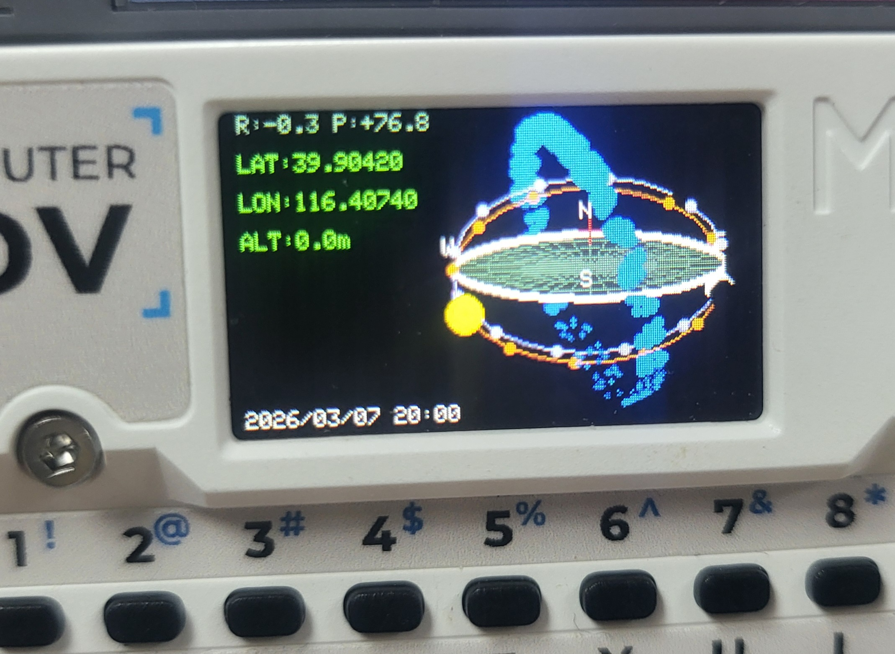
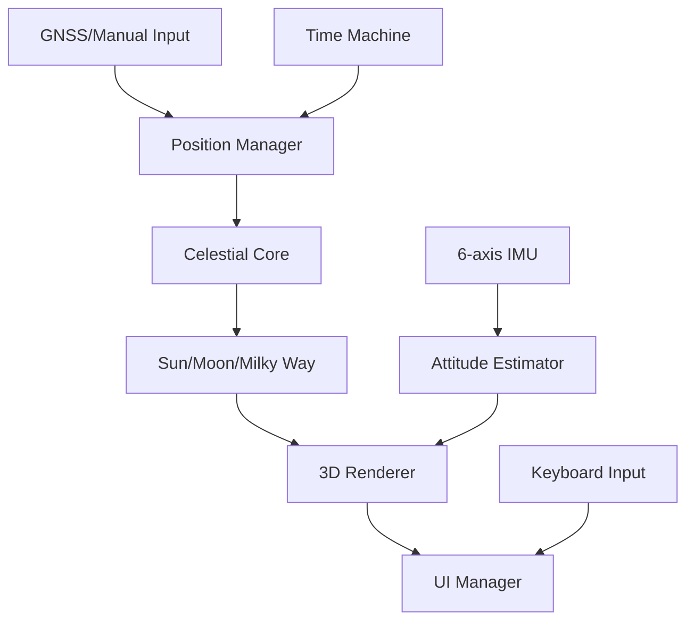

# SkyCompass

[简体中文](README.md) | **English**

## Project Overview

**SkyCompass** is a celestial navigation application running on the **M5Stack CardputerADV**. It obtains positioning via the **Cap LoRa-1262 GNSS** module (manual offline coordinates also supported). It is designed to visualize the solar, lunar, and Milky Way trajectories, as well as calculate astronomical tides. It supports perspective control using the built-in 6-axis IMU.



## Hardware Requirements

- **M5 Cardputer ADV** (ESP32-S3)
- **6-axis IMU** (Accelerometer + Gyroscope)
- **Cap LoRa-1262 GNSS** module (or compatible)
- Keyboard and display

## Project Goals

- **All-Sky Visualization**: Real-time calculation and rendering of Azimuth and Altitude trajectories for the Sun, Moon, and Galactic Center.
- **High-Precision Positioning**: Automatic location via GNSS or manual input of offline coordinates and time zones.
- **3D Immersive Observation**: Uses the 6-axis IMU to map real-world orientation to a 3D sky view.
- **Prediction (Time Machine)**: Predict future or review historical celestial positions at any point in time.
- **Astronomical Tide Calculation**: Theoretical tidal trends based on solar and lunar gravitational potential.
- **Fully Offline**: All astronomical algorithms and data processing are performed locally on the ESP32 with zero network dependency.

## Constraints & Principles

- **Localization**: No external APIs; all functions must be self-contained on the device.
- **Modularity**: Clean separation of HAL -> Core -> App layers for easy extension.
- **Engineering Precision**: Accuracy targeted for photography, navigation, and outdoor use.
- **Adaptive Design**: UI optimized for the Cardputer's unique screen and keyboard layout.

## Architecture

### Module Breakdown

1. **Hardware Abstraction Layer (HAL)**
   - `hal_gnss`: GNSS interface (supporting Cap LoRa-1262).
   - `hal_imu`: 6-axis motion sensor interface.
   - `hal_display`: Screen driver and graphics abstractions.
   - `hal_keyboard`: Full keyboard event handling.

2. **Core Logic Layer (Core)**
   - `celestial_core`: Unified scheduling framework for celestial calculations.
   - `sun_calculator / moon_calculator`: Solar/Lunar astronomical algorithms.
   - `sky_hemisphere`: Geometric model of the celestial sphere.
   - `view_3d_renderer`: 3D projection and scene rendering engine.
   - `attitude_estimator`: Quaternion-based attitude estimation and view synchronization.
   - `position_manager`: Integrated management of time, coordinates, and time zones.
   - `ui_manager`: UI state machine and multi-page rendering.

3. **Application Layer (App)**
   - `app_main`: Main application flow and module coordination.
   - `time_machine`: Logic for time hopping and prediction.
   - `user_input`: Global interaction mapping for keyboard inputs.

### Data Flow



## Features

1. ✅ GNSS Positioning (Lat/Lon, UTC Time)
2. ✅ Sun, Moon, and Milky Way Trajectory Calculation
3. ✅ IMU Attitude Estimation (Perspective Mapping)
4. ✅ Astronomical Tide Potential Forecasting
5. ✅ Time Machine (Date/Time Hopping)
6. ✅ Offline Location/Timezone Support

## Environment

- **PlatformIO** (Recommended)
- **ESP-IDF / Arduino Framework**
- **M5Unified / M5Cardputer Libraries**

## Installation & Usage

1. Clone this repository.
2. Open the project in **PlatformIO**.
3. Install necessary libraries (`M5Unified`, `M5GFX`, `M5Cardputer`, `TinyGPSPlus`).
4. Compile and flash to M5 Cardputer ADV.
5. Wait for GNSS lock (or set coordinates manually).
6. Use the keyboard to navigate menus and toggle features.

## Hardware Limitations

- **Heading Drift**: Due to the lack of a magnetometer, IMU-only attitude estimation will drift over time. Periodic calibration or GNSS-assisted correction is recommended.
- **Signal Quality**: GNSS may struggle indoors or in high-interference environments.

## Directory Structure

```
SkyCompass/
├── README.md              # Chinese Version
├── README_EN.md           # English Version
├── platformio.ini         # PlatformIO Config
├── SkyCompass.ino         # Arduino IDE Entry
├── src/
│   ├── main.cpp           # PIO Main Entry
│   ├── hal/               # Hardware Abstraction
│   │   ├── hal_gnss.h/cpp
│   │   ├── hal_imu.h/cpp
│   │   ├── hal_display.h/cpp
│   │   └── hal_keyboard.h/cpp
│   ├── core/              # Engine & Algorithms
│   │   ├── celestial_core
│   │   ├── sun_calculator
│   │   ├── moon_calculator
│   │   ├── sky_hemisphere
│   │   ├── view_3d_renderer
│   │   ├── attitude_estimator
│   │   ├── position_manager
│   │   ├── ui_manager
│   │   └── log_manager.h
│   └── app/               # Logic & State
│       ├── app_main.h/cpp
│       ├── time_machine.h/cpp
│       └── user_input.h/cpp
└── lib/                   # Dependencies
```

## Accuracy

- **Celestial Positions**: Based on NOAA and standard astronomical models; suited for photography and navigation.
- **Attitude**: Uses complementary/fusion filtering to minimize drift via motion compensation.
- **Tide Model**: Astronomical potential only; does not include local basin or weather effects.
- **Time**: Syncs with GNSS UTC (accuracy within system interrupt latency, typically ms range).

## License

This project is licensed under the [PolyForm Noncommercial License 1.0.0](LICENSE).

**This license allows for personal, educational, and research use, but strictly prohibits any commercial use.**

## Roadmap

- **Offline Terrain**: DEM-based obstruction analysis.
- **Barometric Correction**: Use internal DPS310 for improved altitude accuracy.
- **Planetary Support**: Mars, Jupiter, etc.
