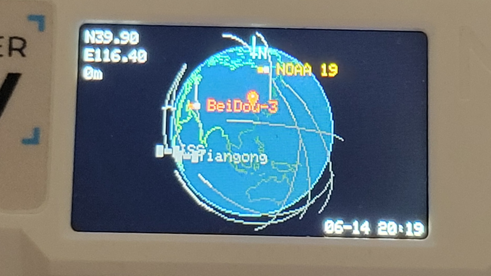
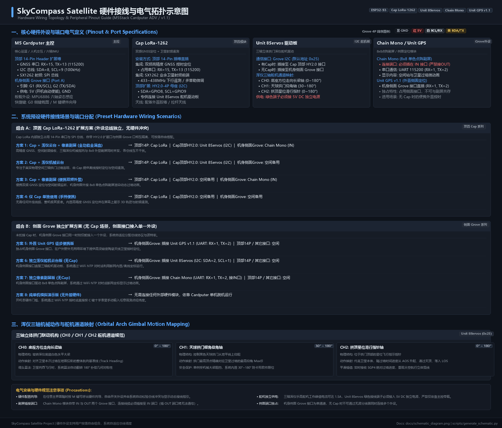

# SkyCompass Satellite (Spacecraft Observation Compass)

[简体中文](README.md) | **English**

> **🔥 Firmware is released on M5Burner! You can directly search for `SkyCompass Satellite` in the official M5Burner tool and flash it with a single click (no compilation required).**



## Project Overview

**SkyCompass Satellite** is an extended and evolved version of the SkyCompass project, designed to run on the **M5Stack Cardputer ADV (ESP32-S3)**. Unlike the original project which focuses on natural celestial bodies (Sun, Moon, etc.), the Satellite version specializes in **real-time spatial tracking and pass visibility predictions for human-made spacecrafts (such as the ISS, Tiangong Space Station, Hubble Space Telescope, etc.)**.

**Core Product Value:** Answering the key question: **"Which spacecraft are worth observing tonight?"**. It is not just a 3D orbital path viewer, but an intelligent observation recommender combining orbital mechanics with optical visibility rating.

---

## Core Highlights

- 🌍 **Minimalist 3D Celestial Earth Globe**: Integrated vector coastlines, solar day/night terminator, polar visual anchors, and 12,000-point NASA nightlight pollution point cloud.
- ⭐ **Smart Observation Recommender**: Computes elevation, solar illumination, and Earth umbra eclipse to dynamically predict visual magnitude and recommend prime passes.
- ⏳ **Time Machine (Simulated Time Travel)**: Scrub backward or forward to preview future orbital passes at will, with a 120ms cooldown gate ensuring silky-smooth 60 FPS operation.
- 📻 **All-Weather Amateur Radio (HAM) Assistance**: Real-time Doppler shift compensation, dual-channel APRS/SSTV monitoring, and space packet capture console.
- 🧭 **Pioneering Solar Shadow Alignment**: Overcomes the lack of an internal magnetometer by aligning the on-screen shadow projection with physical shadows for 100% spatial orientation alignment.
- 🪐 **3-Axis Orbital Arch Gimbal**: I2C linkage with a Lego armillary arch mechanism to physically replicate flight heading, peak pass elevation, and along-track progress.
- 🔋 **Robust Standalone Offline Survival**: 48-hour multi-level TLE flash cache, auto-sleep GNSS power management, and instant sub-second boot in off-grid field conditions.

---

## Hardware Support & Wiring

- **Host Device**: M5Stack Cardputer (Compatible with both ADV and v1.1 Standard versions, with adaptive pin remapping).
- **GNSS Positioning**: Built-in or external GPS/BDS/GLONASS unit (UART 115200bps@8N1).
- **Attitude Sensing**: Onboard 6-axis IMU (MPU6886 / SH200Q, isolated I2C bus running concurrently with GPS).
- **Mechanical Gimbal**: M5Stack Unit 8Servos / PCA9685 driver board + Lego 3-axis armillary structure.
- **RF Expansion**: M5Stack Cap LoRa-1262 transceiver unit (SX1262).



### Preset Hardware Scenarios Quick Reference

Users can freely choose any of the following combinations based on available hardware modules. All scenarios are supported and tested in firmware:

| Hardware Combination | Top 14-Pin Slot | Cap Top HY2.0-4P Port | Side Grove Port A | Hardware Features & Use Cases |
| :--- | :--- | :--- | :--- | :--- |
| **Cap + Gimbal + Pixel Screen** | **Cap LoRa-1262** (GNSS+RF) | **Unit 8Servos** (I2C: G8/G9) | **Chain Mono** (UART: G1/G2) | **All-in-One Concurrency**: Precision GNSS, telemetry capture, 3-axis mechanical gimbal, and 8x8 pixel display all active simultaneously |
| **Cap + Mechanical Gimbal** | **Cap LoRa-1262** (GNSS+RF) | **Unit 8Servos** (I2C: G8/G9) | Idle / Spare | Physical 3-axis space tracking, reproducing orbital heading, peak elevation, and satellite transit progress |
| **Cap + Pixel Screen** | **Cap LoRa-1262** (GNSS+RF) | Idle / Spare | **Chain Mono** (UART: G1/G2) | Portable dual-band positioning, telemetry listening, and real-time pass animations on external 8x8 pixel display |
| **Cap Standalone (Handheld)** | **Cap LoRa-1262** (GNSS+RF) | Idle / Spare | Idle / Spare | **Handheld Portable**: Zero dangling cables, ultra-compact form factor with high-precision GNSS and 433~438MHz RF reception |
| **Unit GPS Portable (Hiking)** | Not attached | - | **Unit GPS v1.1** (UART Dedicated) | External high-sensitivity ceramic antenna GNSS module, ideal for outdoor field observations |
| **Standalone Gimbal (No Cap)** | Not attached | - | **Unit 8Servos** (I2C: G2/G1) | Connects directly to servo driver, synchronized via WiFi NTP or offline cached coordinates |
| **Standalone Pixel Screen (No Cap)**| Not attached | - | **Chain Mono** (UART: G1/G2) | Connects directly to 8x8 display, synchronized via WiFi NTP or offline cached coordinates |
| **Standalone Simulator (No HW)** | No external hardware | - | Idle | Zero extra hardware, runs software simulation using WiFi NTP and manual/preset coordinates (`C` key) |

> 💡 **Hardware Setup Wizard**: Press **`M`** on any main screen to open the interactive Hardware Wizard, toggle connected modules, validate bus conflicts, and view real-time wiring guides.  
> ⚠️ **Servo Power Requirement**: When driving the 3-axis Lego gimbal, connect an **external 5V DC power supply** to Unit 8Servos (peak current up to 1.5A). Do NOT power 3 servos solely from Cardputer.  
> 🔌 **Chain Mono Port**: Connect the Grove cable to the module's **IN port** (connecting to the OUT port will prevent communication).

---

## Interactive Controls & Keybindings

| Key | Action | Description |
| :--- | :--- | :--- |
| **`Enter`** | Toggle Recommended Passes Panel | Press `Enter` on an item to inspect details or jump directly to AOS time |
| **`S`** | Satellite Selection & Encyclopedia | `f` for filter, `d` to del custom, `O` for mission objects |
| **`W`** | WiFi Setup & Sync | Scan hotspots, perform NTP time sync, and fetch latest TLEs |
| **`H`** | Keyboard Help Modal | Pops up floating shortcut keybindings with multi-language support |
| **`L`** | Language Selection (i18n) | Real-time switching between English, Chinese, Japanese, and Spanish (NVS saved) |
| **`M`** | Hardware Setup Wizard | Test and toggle WiFi, GNSS, Magnetometer, and Gimbal peripherals |
| **`V`** | Satellite Follow Mode (Sat View) | Center camera on target; `;` / `.` to switch targets; renders 3D sight line & elevation |
| **`Ctrl`** | RF Telemetry Console | Real-time Doppler tracking, background dynamic waterfall & telemetry capture; `T` injects test |
| **`Aa` (Shift)** | Gimbal Servo Test Mode | `0/1/2` to select axis, `,`/`/` for stepping, with built-in 30°~180° anti-jamming limit |
| **`C`** | Crosshair Manual Location | `;`/`.` for Latitude, `,`/`/` for Longitude, `[`/`]` for Altitude |
| **`,` / `/`** | Time Machine Backward / Forward | Short press steps 60s; hold for fast travel (HUD clock turns yellow when offset) |
| **`R`** | Reset Time Machine & Location | Instantly reverts to real system time and default observer coordinates |
| **`Tab`** | Global Visual Mode Cycle | Cycles through normal, aurora, and night vision red filter modes (also in RF Console) |
| **`Space`** | Lock IMU Perspective | Locks / releases motion-sensor camera orientation |
| **`Del`** | Toggle HUD Overlay | Shows / hides corner telemetry badges |
| **`[` / `]`** | Adjust Backlight Brightness | Hardware backlight dimming (16 ~ 255) |
| **`G0` (Side)** | Lossless Screen Capture | Dumps raw RGB565 via serial; PC script reconstructs 24-bit BMP |
| **`Esc` / `~`** | Back / Exit Overlay | Dismisses dialogs, passes panel, or exits Sat View mode |

---

## Directory & Code Architecture

The codebase is organized into high-cohesion, decoupled architectural layers:

```text
SkyCompass_Satellite/
├── src/
│   ├── app/                      # Application state (time machine, key context)
│   ├── core/                     # Math, astrodynamics & utility libraries
│   │   ├── orbit_utils.*         # SGP4 propagation, GEO slots, formation tracking & viewport focus
│   │   ├── radio_tracking_pipeline.* # Discrete Doppler shift derivatives & pass detection
│   │   ├── coord_transform.*     # TEME / ECEF / Geocentric / ENU precision coordinate conversions
│   │   ├── earth_renderer.*      # 3D vector Earth, satellite projections & day/night terminator
│   │   ├── observation_predictor.* # 7-day pass prediction, magnitude estimation & score engine
│   │   ├── image_utils.*         # Night vision red filter & Base64 serial screenshot pipeline
│   │   ├── text_utils.*          # UTF-8 character width wrapping & smooth marquee scrolling
│   │   ├── encyclopedia.*        # Satellite database & categorization taxonomy
│   │   └── i18n.*                # Multi-language dictionary & font glyph support
│   ├── gimbal/                   # Lego 3-axis armillary gimbal drivers & tracking
│   │   ├── gimbal_tracking_pipeline.* # Sky Patrol arbitration & single-target Sat View tracking
│   │   └── gimbal_controller.*   # Unit 8Servos / PCA9685 I2C servo controller & mechanical limits
│   ├── hal/                      # Hardware Abstraction Layer (HAL)
│   │   ├── hal_gnss.*            # GPS/BDS UART driver, NMEA parsing & power-saving sleep
│   │   ├── hal_imu.*             # 6-axis IMU driver (MPU6886 / SH200Q)
│   │   ├── hal_wifi.*            # WiFi STA scanning, connection management & state listener
│   │   └── hal_radio.*           # SX1262 (Cap LoRa-1262) SPI RF transceiver abstraction
│   ├── hardware/                 # Peripheral display drivers
│   │   └── chain_mono_view.*     # M5Chain monochrome secondary screen refresh & icons
│   ├── ui/                       # View components & presentation pages
│   │   ├── sat_select_view.*     # Satellite picker, encyclopedia views & category filters
│   │   ├── recommendation_view.* # Left pass recommendation drawer & dual-row hardware status bar
│   │   ├── rf_console_view.*     # Fullscreen RF console & raw HEX payload inspector
│   │   ├── wifi_setup_view.*     # WiFi scan pager & on-screen virtual keyboard setup
│   │   ├── servo_test_view.*     # 3-axis gimbal servo calibration & tuning view
│   │   ├── hardware_wizard_view.*# Peripheral configuration wizard (invoked via M key)
│   │   ├── dialog_views.*        # Shortcuts help dialog (with active highlight) & language picker
│   │   └── startup_view.*        # Boot-up 3D spinning globe & progress bar
│   └── main.cpp                  # setup(), loop() event pump & background orbit task
├── docs/                         # Technical whitepapers and hardware design documents
├── scripts/                      # PC companion utilities & offline preprocessing toolchain
│   ├── update_builtin_tles.py    # Factory TLE automated fetcher & C++ header baking script
│   ├── get_screenshot.py         # Lossless raw RGB565 serial stream receiver & BMP reconstructor
│   ├── gen_light_points.py       # NASA Black Marble city lights point-cloud sampler
│   └── optimize_earth_data.py    # Offline trigonometric precomputation for continental vectors
└── platformio.ini                # PlatformIO build configurations and library dependencies
```

### Factory Firmware Packaging & Built-in TLE Updates (scripts/update_builtin_tles.py)

To ensure immediate out-of-the-box offline precision right after a clean flash without requiring an immediate WiFi connection, and to prevent initial boot-up rate-limiting (HTTP 403) from CelesTrak, the project provides an automated factory TLE baking script `scripts/update_builtin_tles.py`:

```bash
# Step 1: Fetch fresh orbital data for all 59 built-in satellites and bake into src/core/builtin_tles.h
python scripts/update_builtin_tles.py

# Step 2: Build and flash firmware
pio run -t upload
```

- **Full Catalog Static Parsing**: Automatically inspects `src/core/encyclopedia.cpp` to extract NORAD IDs and metadata for all 59 built-in targets (Tiangong, ISS, HST, navigation constellations, amateur radio satellites, deep space observatories, etc.);
- **Dual-channel Fallback & Dynamics Engine**: Prioritizes official CelesTrak GP API, seamlessly falling back to open-source orbital mirrors when rate-limited; deep space missions (JWST, Queqiao, Roman) automatically utilize dedicated Keplerian dynamics fitting for 100% coverage;
- **Firmware Static Baking**: Auto-generates read-only C++ header `src/core/builtin_tles.h` with structured TLE arrays and exact second-level UTC timestamps;
- **First-boot Cache Seeding**: On virgin boot (blank LittleFS), the firmware immediately seeds LittleFS with this fresh factory data. Subsequent boots and WiFi syncs reuse valid local cache, eliminating redundant bulk network calls and preventing WAF rate-limiting.

---

## Technical Documentation & Whitepapers

For detailed mathematical models, physical formulations, and developer documentation, please refer to the documents in the `docs/` directory:

| Technical Whitepaper | Topic Overview |
| :--- | :--- |
| 📐 [**Orbital Mechanics & Visibility Prediction**](docs/orbital_calculation_details.md) | SGP4 perturbation model, TEME/ECEF/ENU transforms, atmospheric refraction/extinction, phase function visual magnitude, Doppler derivations & Solar Shadow Alignment |
| 💾 [**Data Layer & Multi-Level Caching**](docs/data_layer_architecture.md) | 6-digit NORAD Catalog ID pseudo-TLE bridge, CelesTrak GP JSON parser, 48h TLE / 7d API offline tiered caching strategy |
| 🛠️ [**Firmware Build & Flash Guide**](docs/firmware_build_guide.md) | M5Burner one-click flashing, PlatformIO Core CLI local compilation and upload, dependency management, and troubleshooting |
| 📸 [**Lossless Screenshot & Toolchain Guide**](docs/screenshot_and_tools_guide.md) | PSRAM-free RGB565 chunked serial streaming, Python receiver script, and offline point-cloud/map preprocessing tools |
| 🔭 [**Armillary Gimbal Design & Operation**](docs/浑仪卫星过境指向功能设计与使用指南.md) | 3-axis Lego mechanics, servo angular ranges and anti-jamming limit protections |
| 📡 [**LoRa & UHF Telemetry Reception System**](docs/卫星LoRa+UHF-GFSK数据接收解析与长期记录系统实现方案v2.md) | SX1262 RF frontend, Doppler auto-tuning, and AX.25 telemetry frame parsing architecture |

---

## Live Screenshots

| 3D Globe & Orbital Trajectory | Satellite Encyclopedia & HAM Info | Shortcut Help Floating Dialog |
| :---: | :---: | :---: |
|  |  |  |

---

## Data Sources & Acknowledgements

- **TLE Orbital Elements**: Special thanks to [CelesTrak](https://celestrak.org/) for providing high-precision, real-time two-line element datasets.
- **3D Coastline Vector Data**: Thanks to [Natural Earth](https://www.naturalearthdata.com/) for offering free 50m resolution global boundary datasets.
- **Global Nightlight Points**: Thanks to [NASA GIBS](https://gibs.earthdata.nasa.gov/) for the VIIRS Black Marble global nightlight imagery.
- **Space Telemetry & Groundstation Inspiration**: Sincere thanks to [TinyGS](https://tinygs.com/) for their open-hardware and global distributed ground station network, pioneering amateur LoRa telemetry tracking and Doppler-tuning inspiration.
- **Model Verification & Reference**: Thanks to [Laysky (天文通)](https://laysky.com/) and [Heavens-Above](https://www.heavens-above.com/) for providing ground-truth pass predictions.

---

## License

This project is licensed under the [GNU General Public License v3.0 (GPLv3)](LICENSE).
