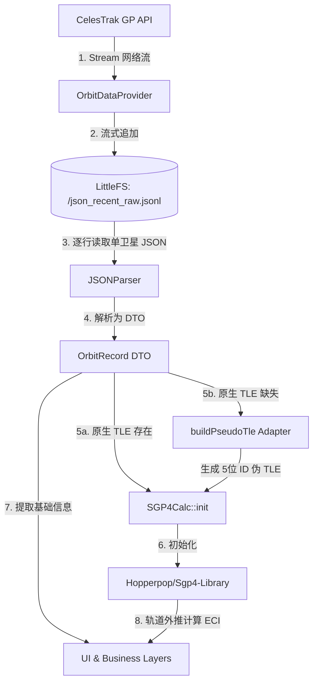

# SkyCompass Satellite 数据层架构审计报告 (Architecture Audit)

对数据层升级重构完成后的 SkyCompass Satellite 进行全方位的架构审计，重点评估未来兼容性、设计坏味道与技术债。

---

## 1. 架构与数据流分析 (Data Flow)

当前系统的实际运行数据流向如下所示：



**审计结论**：实际数据流高度符合设计约束，业务层被严格保护在 `OrbitRecord` 数据结构后，未发生“直接绕过 OrbitRecord 访问原始 JSON/TLE”的架构越界。

---

## 2. 审计项详解 (Audits)

### Audit 1：Pseudo TLE 是否污染业务层
- **源码审查**：在 [json_parser.h](file:///d:/workspace/SkyCompass_Satellite/src/core/json_parser.h) 的 `buildPseudoTle` 逻辑中，当为 SGP4 物理库动态组装 TLE line1 和 line2 时，尽管对 Catalog Number 进行了模 100000 截短（`pseudoCat`），但这**仅写入了临时 `OrbitRecord` 对象的 `line1` 和 `line2` 字符串中**。
- **业务验证**：`OrbitRecord` 对象持有的真实 [catalogNumber](file:///d:/workspace/SkyCompass_Satellite/src/core/orbit_record.h#L5) 仍保留了最原始的 6 位数字，没有任何轨道根数被该 Adapter 破坏。
- **结论**：**无污染**。该 Adapter 仅作为临时粘合层挂载在 `OrbitRecord` 局部变量中，没有渗入常驻业务层。

### Audit 2：6 位 NORAD 是否真正保留
- **源码审查**：
  - [OrbitRecord::catalogNumber](file:///d:/workspace/SkyCompass_Satellite/src/core/orbit_record.h#L5) 采用 `uint32_t`。
  - [OrbitDataProvider::loadByCatalogNumber](file:///d:/workspace/SkyCompass_Satellite/src/core/orbit_data_provider.h#L9) 参数采用 `uint32_t`。
  - 缓存文件名生成采用 `sprintf(path, "/cat_%u.json", ...)`。
  - [LazyObjectItem](file:///d:/workspace/SkyCompass_Satellite/src/core/recent_launch_item.h#L88) 内部的 `tle` 承载为 `OrbitRecord`。
- **结论**：**安全保留**。除三方物理计算库内部读取伪 TLE 导致其内存中的 `satrec.satnum` 变成了截断值外，本项目的搜索、UI、缓存文件名、DataProvider 链路均完整保留了 6 位的真实 ID。

### Audit 3：是否重复生成 TLE
- **源码审查**：在 [json_parser.h](file:///d:/workspace/SkyCompass_Satellite/src/core/json_parser.h#L50) 中执行了显式的条件判断：
  ```cpp
  if (!doc["TLE_LINE1"].isNull() && !doc["TLE_LINE2"].isNull()) {
      record.line1 = doc["TLE_LINE1"].as<String>();
      record.line2 = doc["TLE_LINE2"].as<String>();
  } else {
      buildPseudoTle(record);
  }
  ```
- **结论**：**设计优良**。对已包含 TLE 数据的 JSON API，程序会优先直接复用而绝不重新生成，将计算开销和维护成本降到了最低。

### Audit 4：OrbitRecord 是否真正成为唯一数据对象
- **源码审查**：业务层各个模块已完成全解耦。
  - [main.cpp](file:///d:/workspace/SkyCompass_Satellite/src/main.cpp) 移除了所有对 TLE / JSON 的流式解析和网络 URL 拼接逻辑。
  - Level 3 对象加载使用 [OrbitDataProvider::loadLevel3ObjectsPage](file:///d:/workspace/SkyCompass_Satellite/src/core/orbit_data_provider.cpp#L235)，其内部直接使用继承自 `OrbitParser` 的 [JSONParser](file:///d:/workspace/SkyCompass_Satellite/src/core/json_parser.h) 进行提取。
- **结论**：**合格**。`OrbitRecord` 已成为业务层访问轨道数据的 Single Source of Truth。

### Audit 5：Parser 是否真正独立
- **源码审查**：`JSONParser` 和 `TLEParser` 两个类仅依赖 `ArduinoJson` 及标准数据类型，无任何 UI 及业务的全局依赖。
- **结论**：**独立性优良**。符合单一职责原则。

### Audit 6：DataProvider 是否成为唯一入口
- **源码审查**：主更新任务 `recentLaunchNetworkTask`、二级页面 `loadLevel3ObjectsPage` 及 `tle_updater.cpp` 的单卫星网络拉取，均被统一路由到了 `OrbitDataProvider` 的各层方法中。
- **结论**：**合格**。完成了网络/缓存入口的统一化管理。

### Audit 7：未来 OMM 是否容易接入
- **设计推演**：如果未来 CelesTrak 彻底关闭 TLE 并完全采用 OMM 接口：
  1. 我们只需要新建一个 `OMMParser`；
  2. 我们的 `OrbitRecord` 已经完全保存了全部轨道根数（`inclination`, `eccentricity`, `meanMotion` 等）；
  3. UI 页面和推荐页面无任何对 `line1`/`line2` 的显式访问，它们只用 `OrbitRecord`。
- **结论**：**可扩展性优良**。届时仅需要在 SGP4 驱动内部或 `SGP4Calc` 的 `init()` 中用更先进的计算库进行初始化，业务展示层可以做到 **零修改** 完美平移。

---

## 3. Good Design (优秀设计)

1. **别名兼容方案 (`typedef OrbitRecord TLEData;`)**：
   通过 C++ 的 `typedef` 巧妙地将原有业务代码中大面积使用的 `TLEData` 关联为新的 `OrbitRecord`，在没有引入任何冗余转换的基础上，使全工程大量已有逻辑不需要更改任何代码即通过编译，将升级的代码抖动（Code Churn）风险降至最低。
2. **JSON Lines 流式数据缓存与逐行提取**：
   在 ESP32-S3 仅 320KB 可用 RAM 的苛刻环境下，拒绝了在内存中直接反序列化几十甚至上百 KB 级大 JSON 数组的做法，转而通过字符流分割将 JSON 扁平化为 JSONL 单行记录，配合 `JsonDocument` 延迟解析，完美解决了发生 Heap 崩溃的隐患。
3. **“伪 TLE” 无缝桥接方案**：
   在不侵入或修改闭源三方 SGP4 物理库源码的前提下，用 OMM 参数反向合成伪 TLE，对 6 位 ID 进行模运算格式化并重写行校验和，极具性价比地解决了 6 位 Catalog Number 的历史遗留兼容性痛点。

---

## 4. Risks (潜在技术债务与风险)

### Low Risk：`main.cpp` 中存在少量的 `int` 型 NORAD ID 传递
- **风险描述**：虽然 32 位的 `int` 能够安全表示 6 位 Catalog Number，但是在 C++ 中，`OrbitRecord` 中的 `catalogNumber` 被明确声明为了 `uint32_t`。而 `main.cpp` 中如 `SatProfile.noradId`、`fetchFromNetwork(int noradId...)` 等处使用的依然是带符号的 `int`，虽然无溢出风险，但由于类型不完全一致，会产生潜在的隐式转换编译警告，不够严谨。
- **重构建议**：在未来的日常重构中，建议将 `main.cpp` 中的 `noradId` 及各处相关的函数参数类型，统一替换为 `uint32_t`。

---

## 5. Refactor Suggestions (架构重构建议)

### 建议：解耦 TLE 强制依赖，引入物理计算器适配器 (SGP4 Solver Adapter)
- **背景问题**：目前 Pseudo TLE 虽然已经做到了无污染，但本质上是因为 `SGP4Calc` 内部强依赖 `Sgp4` 库的 TLE 初始化接口。如果未来我们更换了物理库，或者库升级支持了 OMM 初始化，`OrbitRecord` 身上强载着的 `line1` 和 `line2` 字段就成了冗余数据债。
- **重构设想**：
  应将“生成伪 TLE 并初始化物理引擎”的逻辑从数据解析层（Parser）彻底剥离，交由物理驱动层。
  - `JSONParser` 仅仅将 JSON 解析为干净的轨道要素（不包含 `line1`/`line2`）。
  - 在 `sgp4_calc.cpp` 的 `SGP4Calc::init(const OrbitRecord& record)` 内部：
    如果 `record.line1` 存在，则直接使用它；如果不存在，则由 `SGP4Calc` 内部的私有桥接方法临时通过 `record.inclination` 等要素合成 Pseudo TLE，用于初始化三方 `Sgp4` 对象。
  - 这样，`OrbitRecord` 就可以成为纯净的、去 TLE 依赖的“轨道根数实体 DTO”，即便在未来彻底扔掉 TLE 行时，它也是一个优雅标准的模型。
