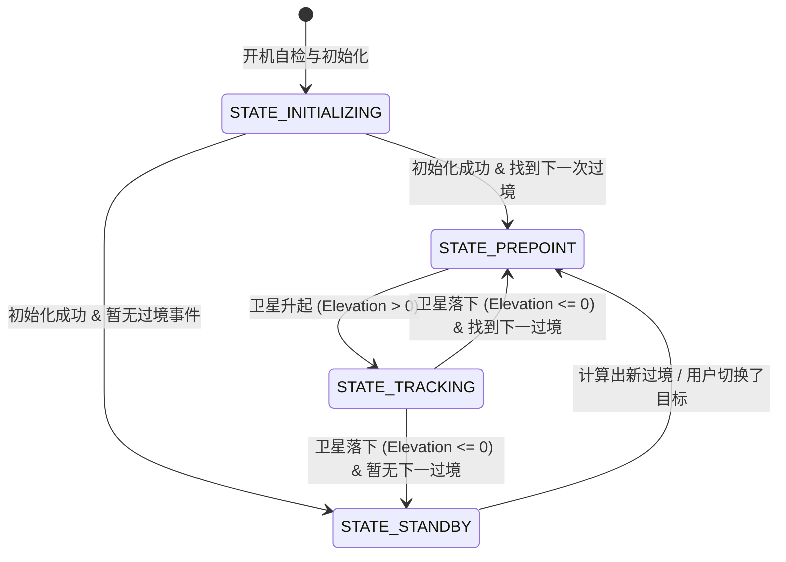

# SkyCompass Satellite: 3轴舵机云台集成方案评估规划

本文档概述了将 3轴舵机云台（通过 M5Stack Unit 8Servos I2C 舵机板驱动）集成到 SkyCompass Satellite 项目中的系统设计、状态机优化、数学映射坐标转换以及异常恢复规划。

---

## 一、 云台状态机生命周期设计（优化版）

根据反馈，云台在“无活动过境事件”的闲时应作为**直观的物理指示器**。它将静静地指向下一次过境卫星即将升起的位置（AOS 入口点），让用户即使不看屏幕，也能一眼知晓未来卫星从哪个方向升起。

### 状态定义与行为

1. **`STATE_INITIALIZING` (自检与初始化)**
   - **行为**：系统上电或检测到 Grove 口插入 8Servos 后，读取 NVRAM (Preferences) 中的零偏值，并控制三个舵机以极慢的速度扫过自检行程，确认初态。
   
2. **`STATE_PREPOINT` (智能预瞄准状态)**
   - **触发条件**：当前卫星落下，或者检测到下一颗待过境卫星。
   - **行为**：获取下一次过境事件的 `AOS 时间` 和 `AOS 方位角`。云台以极其缓和、无声的角速度（如 $1.5^\circ/\text{s}$）将**方位角舵机**对准该 AOS 方向，**高度舵机**放平（0° 贴近地平线），**轨道面舵机**预摆好对应的过境轨迹倾角。
   - **效果**：保持舵机通电自锁，提供静默的物理指示作用，避免外力拨动。

3. **`STATE_TRACKING` (实时跟踪状态)**
   - **触发条件**：当前 `sat view` 中选中的焦点卫星实时高度 $El > 0$（已越过地平线）。
   - **行为**：以 100ms 周期高频刷新输出当前 $Az$ 与 $El$ 的物理映射值。配合软件低通滤波器（Lerp）滤除锯齿抖动，让云台平滑指向天空中该飞行器的方向。

4. **`STATE_STANDBY` (闲时待命状态)**
   - **触发条件**：系统未来较长一段时间内无任何过境数据。
   - **行为**：云台平缓回到正北中点并放平，断开 PWM 输出（Detach）以防震颤发热，降低功耗。

---

## 二、 目标选择与不可见卫星跟踪逻辑

为了让物理设备与用户的屏幕视觉完美对齐，云台的目标指向需具备如下逻辑：

1. **与 UI `sat view` 焦点实时强绑定**：
   - 云台跟踪的目标锁定为当前在 `sat view` 地球上选中的那颗高亮卫星（通过其 ID 识别）。
   - 如果用户在 `sat view` 下通过键盘方向键**切换了高亮焦点的卫星**，云台会瞬间识别目标 ID 变化。

2. **肉眼不可见跟踪（仅限高度判定）**：
   - 过滤掉阴影（Shadow）、光照或星等亮度的判定限制。只要该焦点卫星的实时仰角 $El > 0$（即使它在阴影中不可见，或属于低反射率卫星），云台仍会实时物理指出其在空中的绝对方向。

3. **跨焦点切换的“平滑扫掠”机制 (Smooth Sweep)**：
   - 当焦点卫星被切换时，目标角度会瞬间产生大幅度跳变。
   - 为防止舵机以最大速度暴冲，软件限速器将启动：以最大 $6^\circ/\text{s}$ 的阻尼角速度，平滑地由旧方向“扫掠过渡”到新选中卫星的指向方向，保证观感优雅和机械安全。

---

## 三、 180°限位与对侧指向的数学模型

我们只需表示地平线之上的半个天球，当方位角 $Az$ 超出 $[0^\circ, 180^\circ]$ 时，我们通过**方位轴翻转 180°** + **仰角轴/轨道轴镜像反向**来实现全天球指向，而不需要舵机做 360° 旋转。

设方位舵机输出角度为 $\theta_{az}$，高度/仰角舵机输出角度为 $\theta_{el}$。

| 计算得到的方向值 ($Az$) | 方位角舵机输出角度 ($\theta_{az}$) | 仰角舵机输出角度 ($\theta_{el}$) | 说明 |
| :--- | :--- | :--- | :--- |
| **$0^\circ \le Az \le 180^\circ$** | $\theta_{az} = Az$ | $\theta_{el} = El$ | 正向直接映射（前天球区域） |
| **$180^\circ < Az < 360^\circ$** | $\theta_{az} = Az - 180^\circ$ | $\theta_{el} = 180^\circ - El$ | 反向镜像指向。方位轴旋转到对侧，仰角臂越过 zenith（头顶）指向脑后。 |

---

## 四、 初始化、零偏校准与异常自愈设计

为了确保开箱即用，并在 Grove 接口意外断线、异常强拨时维持系统不死机，我们规划了以下底层鲁棒性机制：

### 1. 防骤动“软启动”缓动控制 (Soft-Start Position Ramp)
- **隐患**：舵机上电一瞬间，由于物理初态未知，直接写入目标脉宽会导致爆发出最大扭矩暴冲，极易产生大浪涌电流引发 ESP32 芯片复位（Brownout），或导致齿轮扫齿。
- **规划**：在首次初始化并 Attach 舵机时，写入初始角度（90, 90, 0）。并在控制主循环中增加加速度限制，开机第一次输出只允许慢慢滑移到目标 AOS 点。

### 2. NVRAM 装配偏置微调 (Calibration Offsets)
- **隐患**：手工组装时，舵盘插入插槽可能会偏离一两个齿距，导致即使发送 90° 也无法严格正对北方。
- **规划**：在系统 NVRAM (Preferences) 中预留 3 个轴的微调量（如 `servo1_offset` 等，范围 $\pm 15^\circ$）。在 Cardputer 界面里提供微调菜单，保存后参数会自动在输出给舵机时叠加，无需拆卸机械结构。

### 3. I2C 非阻塞与热插拔自愈 (Bus Hang Recovery)
- **隐患**：如果运行中拔掉 Grove 线，`Wire.endTransmission()` 默认可能会发生死锁，导致整个 Cardputer 的屏幕和后台计算死机。
- **规划**：
  - 启动 hardware timeout：`Wire.setWireTimeout(25000, true)`（设置超时为 $25\text{ms}$）。
  - 若超时失败 3 次，将云台标记为 `OFFLINE`（离线状态），从而跳过 I2C 写入，确保 UI 与 SGP4 线程顺畅工作。
  - 在主循环中每隔 5 秒在后台尝试握手 `0x25` 地址，一旦 Grove 线重新插紧，云台将自动复活并执行软启动，无缝回归工作状态。
