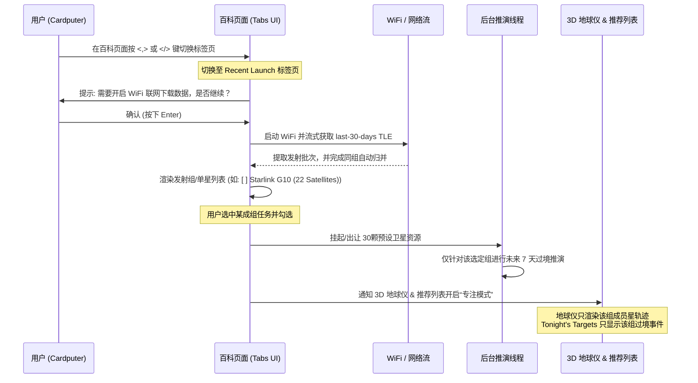

# 🚀 SkyCompass Satellite: 近期发射组(Recent Launch) 交互与系统方案设计

本方案完全融入了用户提出的标签页切换、任务组自动归类合并、按需联网出让资源、以及地球仪与推荐列表“专属专注推演”的先进交互设计。该设计能完美适配 ESP32-S3 资源受限的硬件，并保持极高的通用性与流畅度。

---

## 1. 核心交互与生命周期流程

系统不再将 Recent Launch 混入现有的 Tonight's Targets，而是将其作为 **卫星百科 (Satellites Encyclopedia)** 页面的一个独立标签页 (Tab) 进行深度集成。



---

## 2. 详细系统设计

### 📂 机制一：发射组自动归并与单星展示
在获取 Celestrak 的 `last-30-days` TLE 流时，数据解析器会根据 TLE Line 1 的**国际标识符前 5 位 (Launch Batch ID)** 自动进行去重与归类：
* **成组任务（Launch Batch 相同）**：若属于同一次火箭发射任务（例如 Starlink 批次、OneWeb 批次），系统会在列表中将其**归并为一条复合选项展示**。
  * 命名展示示例：`[ ] Starlink G10-1 (22 Sats)`
* **独立单星（Launch Batch 唯一）**：对于单独发射的科研星或微纳卫星，在列表中作为单条选项展示。
  * 命名展示示例：`[ ] Yaogan-43 (1 Sat)`

---

### 🖥️ 机制二：UI 双标签页 (Tabs) 切换与按需联网
我们复用现有的百科页面渲染器，通过类似于浏览器标签页的设计来分割视图：
* **标签页切换**：用户在卫星百科页面，可以通过按键盘上的 `,` 或 `/` 键，在 `"Satellites Encyclopedia"`（本地离线百科）与 `"Recent Launch"`（近期发射）两个标签页之间来回快速切换。
* **按需联网与延迟出让资源**：
  * **日常状态**：默认处于本地离线百科，设备不连接 WiFi，不占用网络资源，后台对预设的 30 颗百科卫星执行常规推演。
  * **激活状态**：当且仅当用户切到 `"Recent Launch"` 标签页时，屏幕才会弹出黄色高亮提示：
    > `Recent Launch is an online feature.`
    > `Connect WiFi & download data? [ENT/ESC]`
  * 只有在用户按下 `Enter` 且网络成功连接后，系统才会**挂起原本预设的 30 颗百科卫星的推演和渲染任务，释放全部 CPU 与内存资源**，用以容纳新下载的发射组数据。

---

### 🎯 机制三：地球仪与推荐列表的“专注显示 (Focus Mode)”
当用户在 Recent Launch 列表中勾选了需要观测的对象（例如勾选了 `[x] Starlink G10-1`）后，系统会进入**完全专注的工作流**：
1. **地球仪渲染屏蔽**：3D 地球仪上会**自动屏蔽并隐藏**所有其他预设卫星（如 ISS、天宫、哈勃等）的实时位置与轨道线，**画面中仅绘制和追踪选中的该发射组（如 22 颗星链）的串联运行轨迹**。
2. **推荐列表专注解算**： Tonight's Targets 预测引擎**仅对选中的该发射组进行过境计算与排序**。推荐列表中不会混入任何其他无关卫星，实现信息的高纯度聚合。
3. **还原机制**：当用户在 Recent Launch 标签页中取消勾选，或者直接切换回本地百科标签页时，系统会释放临时发射组的内存，并**自动恢复 30 颗预设卫星的地球仪轨迹渲染与 Tonight's Targets 推荐计算**。

---

## 3. 关键数据结构与算法伪代码

### 数据结构设计
```cpp
// 临时发射组/单星选项结构体
struct RecentLaunchItem {
    String batchId;        // 国际标识符前 5 位 (如 "26042")
    String displayName;    // 提取出来的公共名称前缀 (如 "Starlink G10")
    int satelliteCount;    // 该组内包含的卫星数量
    bool isGroup;          // 是否为成组任务
    bool selected;         // 用户是否勾选观测
    std::vector<TLEData> tles; // 该组包含的所有卫星的具体 TLE 数据
};

// 全局状态控制
enum AppTabState {
    TAB_ENCYCLOPEDIA,      // 本地离线百科标签页
    TAB_RECENT_LAUNCH      // 近期发射组标签页
};

extern AppTabState currentTab;
extern std::vector<RecentLaunchItem> g_recentLaunches; // 近期发射临时内存区
```

### 发射组流式归并算法 (核心网络任务)
```cpp
bool parseAndGroupRecentLaunches() {
    WiFiClientSecure client;
    client.setInsecure();
    HTTPClient http;
    http.begin(client, "https://celestrak.org/NORAD/elements/gp.php?GROUP=last-30-days&FORMAT=tle");
    
    if (http.GET() != HTTP_CODE_OK) return false;
    
    WiFiClient* stream = http.getStreamPtr();
    g_recentLaunches.clear();
    
    while (stream->connected() && stream->available()) {
        String name = stream->readStringUntil('\n'); name.trim();
        String line1 = stream->readStringUntil('\n'); line1.trim();
        String line2 = stream->readStringUntil('\n'); line2.trim();
        
        if (name.length() == 0 || line1.length() == 0 || line2.length() == 0) continue;
        
        TLEData tle = {name, line1, line2};
        String batchId = line1.substring(9, 14); // 提取 5 位国际标识符批次号
        
        // 查找是否已经存在该批次的组
        bool found = false;
        for (auto& item : g_recentLaunches) {
            if (item.batchId == batchId) {
                item.tles.push_back(tle);
                item.satelliteCount++;
                item.isGroup = true;
                found = true;
                break;
            }
        }
        
        // 若没有找到，创建新项
        if (!found) {
            RecentLaunchItem newItem;
            newItem.batchId = batchId;
            newItem.displayName = getCommonPrefix(name); // 智能提取卫星公共名字
            newItem.satelliteCount = 1;
            newItem.isGroup = false;
            newItem.selected = false;
            newItem.tles.push_back(tle);
            g_recentLaunches.push_back(newItem);
        }
    }
    
    http.end();
    return !g_recentLaunches.empty();
}
```
