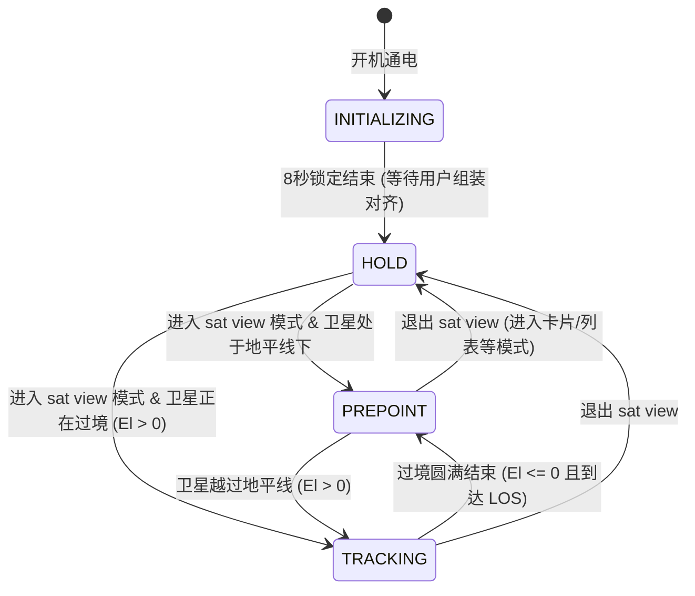

# 浑仪（Orbital Arch Gimbal）卫星过境立体指向系统设计与使用指南

## 一、 系统概述与设计哲学

在古代中国天文观测中，“**浑仪**”（Armillary Sphere）通过嵌套旋转的双环、赤道环与白道环，直观还原天球视运动与星体轨道。

本项目将这一古老的天文学智慧与现代空间轨道力学（SGP4）相结合，借助 M5Stack Cardputer 与乐高机械结构，打造了**现代迷你三轴轨道拱门“浑仪”**。

不同于传统两轴安防云台（仅能输出单点的方位与俯仰），本浑仪通过创新的**三轴立体拱门联动机构**，直观展现卫星过境的**全天球三维圆拱轨迹**：
1. **CH0 方位走向轴（底座地平轴）**：旋转白色水平长梁，将整座浑仪的轨道对称面直接对齐卫星本次过境的地面投影基准线；
2. **CH1 轨道拱高轴（拱门倾角轴）**：控制黑色天球拱门从地平线上仰起，拱门的最高点精确对应本次过境的天顶最大仰角（$Max\ Elevation$）；
3. **CH2 轨道星位轴（拱顶滑行指针）**：代表飞行器本体。过境期间，指针如流星般从拱门的一端升起、滑过天顶最高点、最终沉入对侧地平线，实时重现卫星划过苍穹的宏伟动态。

```
                       [CH1 拱门仰起: 最大仰角 MaxEl]
                                 ^
                                / \  <--- [CH2 星位指针: 随过境进度滑行]
                               /   \
                              /     \
    [地平升起 AOS] ----------+-------+---------- [地平降落 LOS]
                     \               /
                      \ [白色水平大梁] /
                       ==============
                             |
                      [CH0 底座方位轴: 对齐升起走向]
```

---

## 二、 硬件架构与电气连接

| 硬件模块 | 连接接口 / 规格 | 说明 |
| :--- | :--- | :--- |
| **主控** | M5Stack Cardputer (ESP32-S3) | 运行 SGP4 轨道动力学解算与交互 UI |
| **驱动板** | M5Stack Unit 8Servos (STM32) / Module SERVO2 (PCA9685) | Grove I2C 接口，总线默认地址 `0x25` (Unit8Servo) 或 `0x40` (PCA9685) |
| **引脚定义** | Grove 端口：SDA = GPIO 2, SCL = GPIO 1 | 内置非阻塞防死锁 I2C 驱动与总线热插拔检测 |
| **CH0 舵机** | 底座地平面方位轴 | 0° ~ 180° 对应地平全方位翻转映射 |
| **CH1 舵机** | 黑色轨道拱门仰角轴 | 0° ~ 90° 对应天球最高仰角 |
| **CH2 舵机** | 拱顶星位指针滑行轴 | 0° ~ 180° 对应 AOS 升起到 LOS 降落的连续轨道进度 |

---

## 三、 浑仪几何解算与数学映射模型

由于标准微型舵机的行程为 $0^\circ \sim 180^\circ$，浑仪采用几何对称映射算法覆盖 $360^\circ$ 全天球：

### 1. 方位与拱门对称折叠算法 (`calculateArchAngles`)
设卫星过境升起方位角为 $AOS\ Az \in [0^\circ, 360^\circ)$，最高仰角为 $MaxEl \in [0^\circ, 90^\circ]$，归一化过境进度为 $Progress \in [0^\circ, 180^\circ]$：

- **正向过境区间（$0^\circ \le AOS\ Az \le 180^\circ$）**：
  $$\theta_{Az} = AOS\ Az$$
  $$\theta_{Progress} = Progress \quad (0^\circ \to 180^\circ)$$
- **对侧镜像区间（$180^\circ < AOS\ Az < 360^\circ$）**：
  白色横梁在几何上两端完全对称，因此仅需旋转到对侧即可表达相同的轨道走向线：
  $$\theta_{Az} = AOS\ Az - 180^\circ$$
  $$\theta_{Progress} = 180^\circ - Progress \quad (180^\circ \to 0^\circ \text{ 反向滑行})$$
- **拱门倾角**：
  $$\theta_{Incline} = \text{clamp}(MaxEl, 0^\circ, 90^\circ)$$

---

## 四、 状态机生命周期与行为规范

浑仪控制器内置了严密的安全与行为状态机，防止机械干涉、暴冲及无效发热：



### 各状态行为详解

1. **`INITIALIZING` (开机保护与对齐锁定)**
   - **行为**：开机前 8 秒内，强制输出 $90^\circ, 90^\circ, 90^\circ$ 脉宽，全轴刚性锁定。RGB 状态灯亮**金黄色**。
   - **设计目的**：为用户提供充足的时间把乐高配件垂直卡入转轴中心，杜绝开机乱转打齿。
2. **`HOLD` (原地静止待命)**
   - **行为**：当处于非 `sat view` 模式（如主界面卡片、推荐列表、潮汐模式、设置等）时，云台立即冻结在当前物理角度，完全静止不动。
   - **设计目的**：避免闲时频繁归中打扰用户，保护舵机齿轮并降低待机功耗。
3. **`PREPOINT` (智能预瞄准状态)**
   - **行为**：当处于 `sat view` 模式且焦点卫星在地平线以下时，系统自动检索该卫星未来最近一次过境；以 $3.0^\circ/\text{s}$ 的平稳低速将白色大梁转到下次升起方位，拱门仰到下次目标高度，CH2 星位指针停在拱门起点起跑线待发。RGB 状态灯亮**橙色**。
   - **设计目的**：让用户直观预知下一次卫星从哪里升起、仰角多高，实现沉浸式天象预演。
4. **`TRACKING` (过境实时跟踪状态)**
   - **行为**：卫星升出地平线（$El > 0$）期间，启动“**过境会话锁定**”（Pass Session Lock）。CH0（方位基准）与 CH1（拱门高度）全程刚性锁定为常数，**零跳变、零抖动**；CH2 星位指针沿拱门顺滑滑过苍穹。RGB 状态灯亮**绿色**。

---

## 五、 核心算法与稳定性保障

### 1. 过境会话刚性锁定（Pass Session Lock）
- **问题背景**：在卫星过境持续的 5~10 分钟内，如果因后台重算过境列表、或用户使用时光机微调时间，目标方位可能发生瞬时跳变，导致舵机剧烈抽动。
- **解决方案**：引入会话锁定保护。卫星一旦升起进入过境，系统建立单一 `PassSession`，将基准走向与最大仰角牢牢锁死在会话常数中。无论后台如何交换列表，CH0 与 CH1 稳如磐石，只有 CH2 指针平滑前行。

### 2. 全天候物理过境闭环（含地影与白天过境）
- 修正了传统观测预测器仅保留光学夜空过境的局限，确保在卫星落下地平线（$El < 0$）时完整记录物理落山时间（$losTime$）与落山方位。哈勃望远镜、天宫空间站、业余无线电卫星无论在白天还是地影区，均能在浑仪上精准呈现。

### 3. SGP4 实时巡航保底推算
- 在过境结束时，若预计算列表因重算暂时未就绪，系统内置针对当前焦点卫星的轻量 SGP4 快速向前巡航（步长 60s，探测未来 6 小时，耗时 < 1ms），100% 确保能够抓取下一次过境参数并完成优雅预瞄准。

---

## 六、 快速安装与使用操作指南

1. **安装校准**：
   - 参见文档 [云台上电归中对齐.md](file:///d:/workspace/SkyCompass_Satellite/docs/%E4%BA%91%E5%8F%B0%E4%B8%8A%E7%94%B5%E5%BD%92%E4%B8%AD%E5%AF%B9%E9%BD%90.md)；
   - 通电后在前 8 秒内将白色长梁（水平正东正西）、黑色拱门（垂直立起指向正上方天顶）、拱顶指针（正中天顶）卡入转轴。
2. **启动追踪**：
   - 在 Cardputer 键盘上按回车或空格进入 **`sat view`（卫星 3D 地球视角）**；
   - 使用方向键左右切换选中关注的卫星（如 ISS、哈勃 Hubble、天宫 Tiangong 等）；
   - 若卫星在地平线以下，浑仪静默预瞄准至下一次升起起点；
   - 卫星升起时，浑仪自动亮绿灯并实时演示立体过境！
